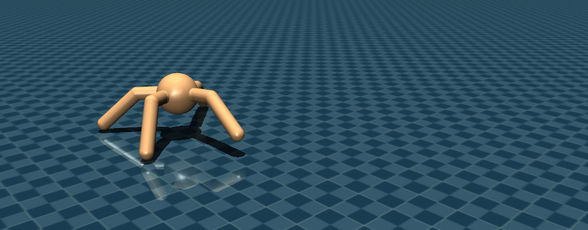
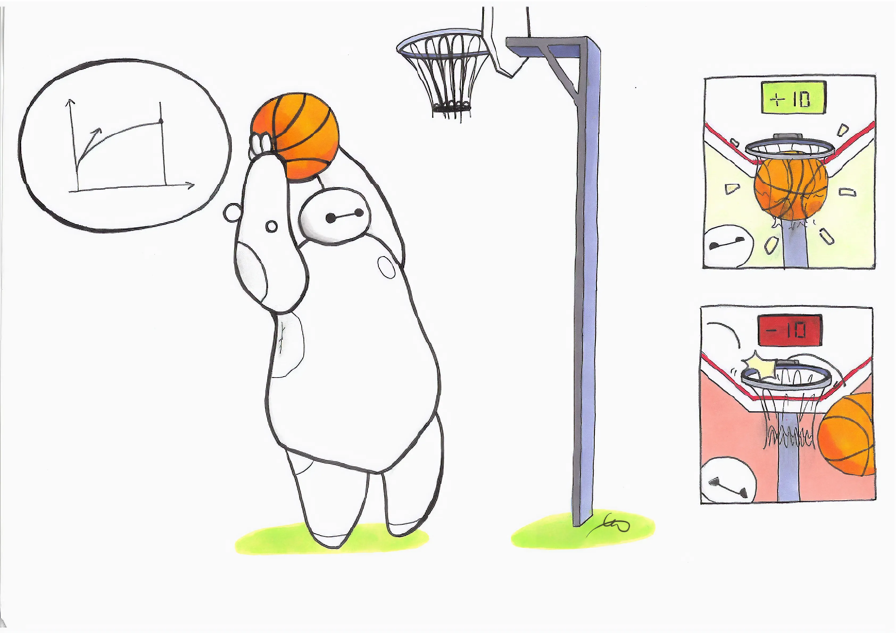
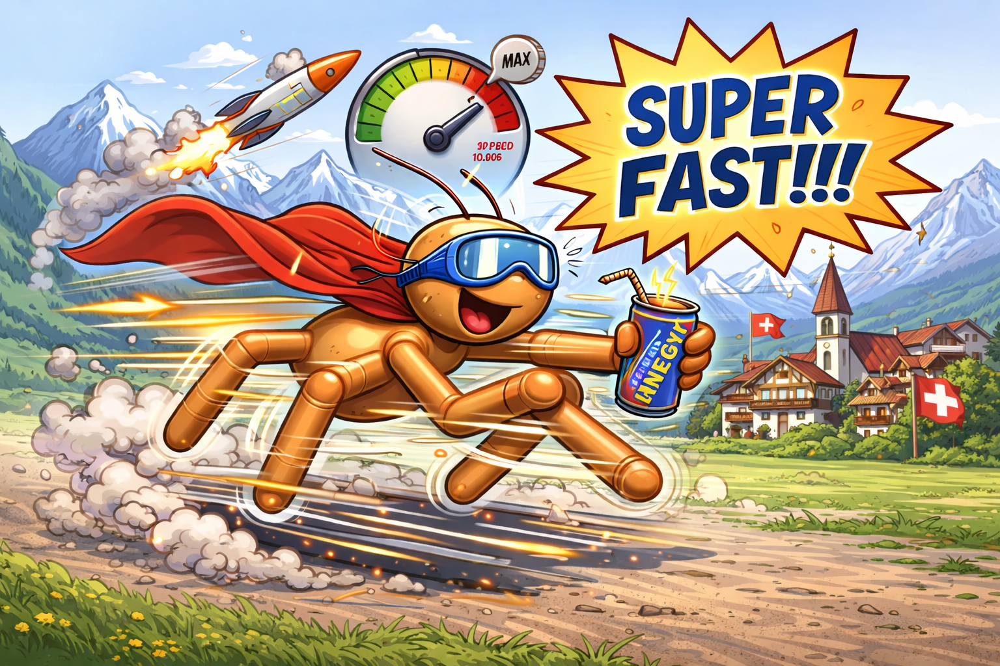

# Challenge 1: Evolving Neural and Oscillatory Controllers with OpenAI Gym



In Challenge 1, you will evolutionary algorithms to evolve a neural controller to let an abstract four-legged robot learn to locomote on a flat surface as fast as possible. 

## Learning Goals

<a></a>

In this challenge, you will ...
- implement a learning environment according to the widely used OpenAI Gymnasium convention [Towers et al. 2024](https://arxiv.org/abs/2407.17032) for the high-dimensional benchmark environment `Ant`,
- interface the environment with a state-of-the-art evolutionary algorithm of your choice,
- design your own evolvable neural network controller and an oscillatory controller
- compare evolutionary optimization to deep reinforcement learning

## Good to know!

This code in this exercise has three main running scripts ([Challenge 1a](/Challenge1a.py), [Challenge 1b](/Challenge1b.py), [Challenge 1c](/Challenge1c.py)) provided in directly in the exercise. You will need to make them functional by solving the `#TODOs` in the `evorob` codebase.

## Challenge 1a: OpenAI Gym Convention

We will implement our own version of the `Ant`-environment. The `Ant` is a four-legged abstract robot where we read the joint angles and velocities and control the torque in 8 joints to make the robot run as fast as possible. 

1. Find `ant_flat.py` in the `evorob` codebase ([evorob/world/envs/ant_flat.py](evorob/world/envs/ant_flat.py)).

<div align="center">
  
</div>

All Gym environments cohere to the following structure. Our agent/policy selects an action $a_t$, this action is executed in an Environment. Due to the action $a_t$, our environment changes from state $s_t$ to $s_{t+1}$. This change in state results in a step reward $r_t$. For evolutionary optimization, we consider accumulated rewards over a life-time or episode $R = \sum_{i}^T r_t$. By defining a Gym environment, we can run evolutionary and deep reinforcement algorithms with the same "problem" definition. Conveniently `Gymnasium` provides a neat integration with the MuJoCo simulator and many other convenient tools. To define a Gym environment, our Python-code should look like this:

```python
class YourGymEnvironment
	def __init__(self):
		# Define parameters required for your environment.
		pass

	def reset_model(self):
		# Tells the simulator how the initial condition after a 
		# reset of the environment should look like.
		# In robotics, we usually randomize the starting conditions
		# to prevent overfitting and get higher robustness.
		raise NotImplementedError

	def step(self):
		# Performs a state-transition in the simulation environment.
		# After the transition, we provide a new **observation** of this
		# state (so partial information of the world, such as using sensors 
		# in the real world). 
		raise NotImplementedError

	def _get_obs(self):
		# We return a new **observation** of the environment state.
		# A observation is partial information of the world, such as 
		# using sensors of a robot in the real world. We should have 
		# sufficient information to solve a problem at hand (e.g., 
		# our current global position in a navigation task).
		# We can access a large range of information from MuJoCo 
		# (https://mujoco.readthedocs.io/en/stable/APIreference/APItypes.html#struct-types).
		raise NotImplementedError

	def _get_rew(self):
		# With the reward, we define what kind of behavior we want to 
		# encourage. A well-defined reward can significantly help our 
		# evolutionary or reinforcement learning process. Vice versa, a 
		# too-strictly-defined reward or uninformative reward can result 
		# in no learning at all.
		raise NotImplementedError

	def _get_termination(self):
		# In many situations it is very useful to define a termination 
		# condition, when we should automatically call the reset (e.g., 
		# after our robot crashed or fell down and is unable to setup 
		# again).
		raise NotImplementedError
	
```

2. Define the observation function (`_get_obs()`) in the following way: We want to return a numpy array containing the robot state **excluding the x,y position** (to make the task translation-invariant). Specifically, concatenate: `self.data.qpos[2:]` (z-position, orientation quaternion, joint angles) and `self.data.qvel` (all velocities). The resulting observation should have 27 dimensions (13 positions + 14 velocities). (**Hint**: Use `np.concatenate()` to combine the arrays).

3. Define the reward function (`_get_rew()`) with a forward reward of $r_{forward}=1.0*v_x$, a "survival" reward of $r_{healthy}=1.0$ for not terminating and a cost of $r_{control}=-0.5*\sum (\tau)^2$ to penalize torque and hopefully achieve a more efficient gait. (**Hint**: The actions are directly defining the torque applying to the joints.)

4. Define the termination function (`_get_termination()`) where we terminate (and reset) the environment, when our robot torso height is below $0.26$ (falling) or above $1.0$ (jumping). (**Hint**: You can access the height via `torso_height = self.state_vector()[2]`)

5. Now execute the main running script (`python3 Challenge1a.py`) and see if your environment is well-defined.


## Challenge 1a: Neural Network Controller

Now, we need a structure to decide which actions to take given the current observation. Sufficiently large Feedforward Neural Networks or Multi-layer Perceptrons are in theory capable to approximate any continuous function (see Universal Approximation Theorem), which provides a powerful structure to optimize for evolution.

1. Find `mlp.py` in the `evorob` codebase ([evorob/world/robot/controllers/mlp.py](evorob/world/robot/controllers/mlp.py)).

You will find the following structure:

```python
class NeuralNetworkController(Controller):
    def __init__(
        self,
        input_size: int,
        output_size: int,
        hidden_size: int = 16,
    ):
        # Here we randomly initialize our neural network layers, 
		# as well as our input and output size.
		self.n_input = input_size
        self.n_output = output_size
        self.n_hidden = hidden_size
		
		self.input_to_hidden = ...
		self.hidden_to_output = ...

		self.n_params_i2h = ...
		self.n_params_h2o = ...

		self.n_params = self.get_num_params()

    def get_action(self, state):
        # We perform a forward pass computation through the layers,
		# providing an action.

    def set_weights(self, encoding):
        # We take the weights generated by the evolutionary algorithm,
		# and overwrite the parameters of the neural network with the
		# evolved parameters.

    def get_num_params(self):
        # To provide a genetic encoding for our neural network controller,
		# we compute and store the number of parameters in our NN class.
    
```

2. Randomly initialize two weight matrices mapping from input-to-hidden layer and hidden-to-output layer, compute the number of parameters for each layer with a uniform distribution. (**Hint**: NumPy can generate pseudo-random arrays with [`np.random.uniform`](https://numpy.org/doc/stable/reference/random/generated/numpy.random.uniform.html)). Already a small neural network can solve the task, therefore we choose a hidden layer size of $16$.

3. Implement the forward pass (`get_action( )`) performing dot matrix multiplications (see either the [`@`-operator](https://peps.python.org/pep-0465/) in Numpy or [`np.matmul`](https://numpy.org/doc/2.1/reference/generated/numpy.matmul.html)). Note that matrix multiplications are signficantly faster than using nested `for`-loops. Implement the following signal flow: `27 (state_size) -> 16 --> 8 (action_size)`. Use `np.tanh` as non-linear activation function, which restricts the action output between $-1$ and $1$. 

4. Implement the computation of total parameters (`get_num_params( )`).

5. Evolutionary algorithms used in this class will provide a direct genetic encoding with size `(n_params, 1)` for each population member. Implement the weight setter (`set_weights( )`), where the encoding is mapped to the weight matrices. (**Hint**: Split the encoding according the respective number of parameters using NumPy's [array slicing](https://numpy.org/doc/stable/user/basics.indexing.html) and then use [`np.reshape`](https://numpy.org/devdocs/reference/generated/numpy.reshape.html) with the previous matrices).

6. Now execute the main running script (`python3 Challenge1a.py`) and see if your neural network controller is well-defined.

## Challenge 1a: Evolutionary Algorithm Framework

Congratulations, you have a functional training environment and a neural controller. Instead of writing our own evolutionary algorithm, we can also use rigorously tested public frameworks: there are numerous projects available. A lot of implementations use a so-called `ask-tell`-interface, which looks like this:

```python
class PowerfulEvolutionaryAlgorithm:
	def ask(self):
		# Generates a new population of solutions given internal statistics 
		# updated by tell()
		...
		return solutions

	def tell(self, solutions, scores):
		# Receives previous populations (solutions) and fitness (scores) 
		# and updates the internal statistics. One of this internal statistics 
		# could be e.g., mean-vectors or an archive of parents.
		...
```

1. Checkout state-of-the-art evolutionary algorithm frameworks in Python using the `ask-tell`-interface.
- https://github.com/CMA-ES/pycma
- https://github.com/icaros-usc/pyribs/
- https://github.com/RobertTLange/evosax/
- https://github.com/google/evojax
- https://github.com/adaptive-intelligent-robotics/QDax

(**Hint**: CMA-ES is comparatively simple and a good starter! Pyribs and QDax are optimized for Quality Diversity algorithms and are more challenging to interface. Evosax and Evojax use the numerical computation framework Jax, which comes with own [sharp bits](https://docs.jax.dev/en/latest/notebooks/Common_Gotchas_in_JAX.html)).

2. Check the documentation of your selected framework and `pip install ...` the framework.

3. Find `ea_api.py` in the `evorob` codebase ([evorob/algorithms/ea_api.py](evorob/algorithms/ea_api.py)).

4. Implement the interface so that the parameters of your framework are correctly assigned at initialization, that the `ask()` generates a population of solutions as a numpy array of shape `(population_size, num_params)` where each row represents one candidate solution with all neural network parameters, and the `tell()` method internally updates the algorithm state with the evaluated fitnesses. (**Hint**: `cma-es` requires the parameters to be passed as `dict` datastructure called `opts`, `evosax` requires manually handling of state and random keys.)

5. Now execute the main running script (`python3 Challenge1a.py`) and see if your evolutionary algorithm API is well-defined.


## Challenge 1a: Run evolution

Checkout the full script of `Challenge1a.py` [/Challenge1a.py](/Challenge1a.py) and uncomment the `run_evolution_neural_controller()` function to enable the full evolutionary run. Your goal is to achieve a fitness score of at least $800$ given the correct reward function. Here some small guideline:

- Blackbox optimizers such as evolutionary algorithms (not unlike real biological evolution) can take significant time to achieve sufficient performance. Run your evolutionary algorithm for at least 300 generations for the final run. 

- To validate that your algorithm is running correctly, let it run for some dozens of generations and evaluate the best population performance as well as the mean performance. While it can take time until evolution finds rapidly emergent behavior, small positive improvements should be noticable.

- When you do changes approach it systematically. Ensure that all units of you algorithm are providing the expected results. Your IDE provides debugging tools which could proof to be very helpful.
	- E.g., are the terms in the reward function sufficiently balanced or does e.g. the control penalty overpower the forward reward? 
	- Is the observation space sufficient to learn the desired task? 
	- Is the reward correctly calculated (or do you mean the rewards over the wrong axis)? 
	- Are the hyperparameters reseasonable (e.g., is the mutation rate large enough to explore new solutions, but small enough to allow incremental improvement)? 
	- How random is the task? Should you run multiple iterations of the same phenotype to have a more balanced fitness landscape?
	- Are the neural network control parameters initialized correctly (e.g., zero initialization leads to zero torque)?

- Inspect frequently the rendering to validate that the algorithm optimizes towards the desired behavior. Sometimes an unexpected trivial behavior can achieve high rewards (e.g. standstill can be achieved by high healthy rewards and reward for low action frequencies).

- Evolution is sensitive to the starting conditions: There are seeds which will be initialized in unfavorable conditions resulting in low performance or the opposite despite not-optimal hyperparameters, you initial parameterspace is close to a high-performing fitness landscape. For proper evaluation, multiple random seeds are always recommended.

- Population size is a highly critical parameter for most variants of evolutionary strategies: if too low, the algorithm might not discover better solutions, if too high, even outstanding genotypes might be averaged away. For the `Ant`, we recommend at least $250$ population members. Note that the computation time scales linearly with population size.


## Challenge 1b: Evolving Oscillatory Controller

While in theory MLP neural networks can facilitate any continuous function, in practice evolutionary algorithms but also backpropagation is usually not discovering an optimal mapping. Therefore, it might be useful to include a so-called inductive bias. Unlike policy gradient methods used in reinforcement learning, evolutionary algorithms do not require differentiable architectures. So we easily include the following assumption: For flat terrain locomotion, a good controller will generate a periodic / sinosoidal signal.

1. Find `sinoid.py` in the `evorob` codebase ([evorob/world/robot/controllers/sinoid.py](evorob/world/robot/controllers/sinoid.py)).

2. Implement a parameterized sinoidal signal generator for each torque output. Parameterize by randomly initializing the amplitude, the frequencies and phases for each action. (**Hint**: To generate periodic signals, your controller has to manually keep track of the current time step, so increment it with every action call.)

```python
class OscillatoryController:
    """Simple oscillatory controller using sine waves for each actuator."""

    def __init__(self, num_actions: int):
        self.num_actions = num_actions
        self.time_step = 0.0
        self.n_params = self.get_num_params()

        # Parameters: [amplitudes, frequencies, phases] for each actuator
        self.amplitudes = ...
        self.frequencies = ...
        self.phases = ..

    def get_action(self, state):
        """Generate oscillatory actions based on time."""
        del state # not used for oscillatory controller

        # Simple sine wave oscillations
        actions = ...

        return np.clip(actions, -1.0, 1.0)

    def set_weights(self, weights):
        """Set controller parameters from flat array."""
        ...

    def get_num_params(self):
        """Return total number of parameters."""

    def reset_model(self):
        self.time_step = 0.0
```

3. Now execute the main running script (`python3 Challenge1b.py`) and see if your oscillatory controller is well-defined.

4. Uncomment `run_evolution_oscillatory_controller()` and execute the evolution with the oscillatory controller. **Question**: How does the initial fitness, the fitness convergence over generations and the best fitness compare between oscillatory and neural controller on this locomotion task for the same evolutionary algorithm (including the same hyperparameter settings)? Can you think of a scenario where the neural controller will outperform the oscillatory controller?
 

## Challenge 1c: Deep Reinforcement Learning

The training environment with Gymnasium can also be used to perform deep reinforcement learning. One of the most popular algorithms is Proximal Policy Optimization (PPO) proposed by (Schulman et al. 2017)[https://doi.org/10.48550/arXiv.1707.06347]. PPO is comparatively robust to different hyperparameter choices and is capable of solving tasks with high complexity when combined with sophisticated reward shaping. Here, we will compare your evolutionary algorithm with PPO. 

<div align="center">
  
</div>

1. Check the documentation of [`stable-baselines3`](https://stable-baselines3.readthedocs.io/) and install the package via pip.

2. Check the main running script [Challenge1c.py](/Challenge1c.py) and import your environment using the `make_vec()` function of `stable-baselines3`. (**Hint**: `make_vec` accepts your class directly an does not require registration via `gymnasium.register`).

3. Run the training and compare the evolutionary algorithm with deep reinforcement learning. Note that episode return is comparable to the masked fitness used in the `evorob` framework. **Question**: How does episode return, convergence behavior over training steps and the converged final performance compare between reinforcement learning and evolution? 


# Challenge 1 Submission Details

The given exercise should provide an fundamental understanding of practical aspects of evolutionary robotics and concepts explained in the lecture. We encourage you to experiment with different evolutionary algorithms, hyperparameter settings and perform modifications to control architecture and learning curriculum in order to evolve the fastest flat-terrain Ant in __MICRO-515__ history!

<div align="center">
  
</div>

To master Challenge 1, submit:
- the weights and code of your final controller. The controller should be compatabile with the `controller` interface presented in the exercises.
- a video rendering of your Ant.
- a fitness graph showing the evolution of fitness over generations.
- a textfile `README.md` describing shortly the selected algorithm, environment design and controller (max. 300 words).

Provide all documents in a zipped folder with the following naming convention: `2026_micro_515_SCIPER_TEAMNAME_LASTNAME1_LASTNAME2.zip`.

We will compare all submissions and publish the results on a leaderboard with the provided teamname at submission. While you might adapt the reward function, the final fitness evaluation should be performed on the default `Ant-v5` environment as provided in the evaluation script.


# Questions?

If some parts of your code are not working or you have general questions, do not hesitate to contact your MICRO-515 teaching assistants in the exercise sessions or via e-mail `fuda.vandiggelen@epfl.ch`, `alexander.ertl@epfl.ch`, `alexander.dittrich@epfl.ch`, `hongze.wang@epfl.ch`.