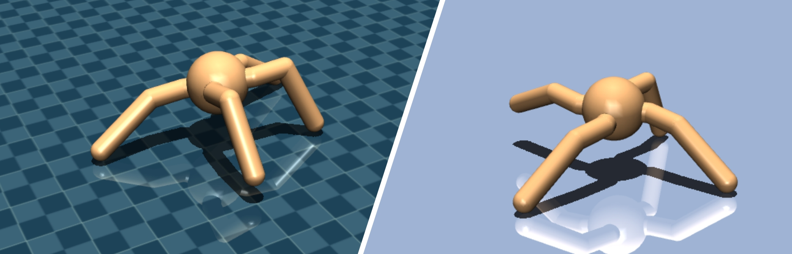
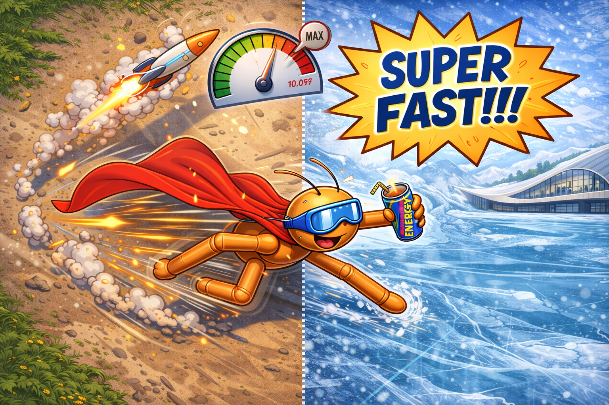

# Challenge 2: Evolving Multi-objective Neural Controllers in Two-Terrain Scenario



In Challenge 2, you will use multi-objective evolutionary algorithms to evolve specialist and generalist neural controller to let an abstract four-legged robot learn to locomote on a flat surface with different friction conditions as fast as possible. 

## Learning Goals

<!--<a></a>-->

In this exercise, you will ...
- implement the baseline multi-objective evolutionary algorithm __Non-sorting Genetic Algorithm II__ proposed by [Deb et al. 2002](https://doi.org/10.1109/4235.996017).
- compare single-objective specialist controllers to controllers on the Pareto front evolved by your multi-objective algorithm.


## Good to know!

This exercise builds on the skills you developed in Challenge 1. You will now implement NSGA-II, a multi-objective evolutionary algorithm that can optimize multiple competing objectives simultaneously (e.g., speed on flat terrain vs. speed on rough terrain). The main running script is [Exercise2.py](/Exercise2.py), and you'll work with the `evorob` codebase to make it functional.

## Exercise 2: Understanding Multi-Objective Optimization

In Challenge 1, we optimized a single objective: moving forward as fast as possible. In real robotics, we often face multiple competing objectives:
- Speed on flat terrain vs. speed on rough terrain
- Energy efficiency vs. maximum speed  
- Robustness vs. performance

NSGA-II helps us find a **Pareto front** of solutions where improving one objective requires sacrificing another. This gives us a diverse set of specialized and generalist controllers.

<div align="center">
  
</div>

## Exercise 2a: Pareto Dominance

The core concept in multi-objective optimization is **Pareto dominance**. Solution A dominates solution B if A is at least as good as B in all objectives AND strictly better in at least one objective.

1. Find `nsga.py` in the `evorob` codebase ([evorob/algorithms/nsga.py](/evorob/algorithms/nsga.py)). You will find the following structure:

```python
class NSGAII(EA):
    def ask(self) -> np.ndarray:
        # Generate new population (already implemented)
        ...

    def tell(self, population, fitness, save_checkpoint=False):
        # Update with evaluated solutions (already implemented)
        ...

    def dominates(self, individual, other_individual) -> bool:
        # TODO: Implement Pareto dominance check
        ...

    def fast_nondominated_sort(self, fitness):
        # TODO: Sort population into Pareto fronts (partially implemented)
        ...

    def compute_crowding_distance(self, fitness, front):
        # TODO: Compute crowding distance for diversity
        ...
    
    def crowding_operator(self, idx_a, idx_b, ranks, crowding):
        # TODO: Compare individuals by rank and crowding distance
        ...
    
    def tournament_selection(self, ranks, crowding, tournament_size):
        # Select parent via tournament (already implemented)
        ...
```

2. Implement the `dominates()` function. This function receives fitness values for two individuals and returns `True` if the first dominates the second.

**Mathematical definition** (for maximization):
Individual $x$ dominates individual $y$ if:
- $\forall i: f_i(x) \geq f_i(y)$ (at least as good in all objectives)
- $\exists i: f_i(x) > f_i(y)$ (strictly better in at least one objective)

**Implementation hints:**
- Use Python's `all()` and `any()` functions with list comprehensions
- Use `zip(individual, other_individual)` to iterate over objective pairs
- Example: `all(x >= y for x, y in zip(ind1, ind2))`

3. Now execute the main running script (`python3 Exercise2.py`) to test your `dominates()` function. The test script will:
   - Create sample multi-objective fitness values
   - Test dominance relationships
   - Verify your implementation returns correct True/False values

**Example test cases:**
- `[5, 3]` dominates `[4, 2]` → True (better in both)
- `[5, 2]` dominates `[4, 3]` → False (trade-off, neither dominates)
- `[5, 3]` dominates `[5, 2]` → True (equal in first, better in second)

## Exercise 2b: Fast Non-Dominated Sorting

NSGA-II uses **fast non-dominated sorting** to rank solutions into Pareto fronts:
- **Front 0**: Non-dominated solutions (the best)
- **Front 1**: Solutions dominated only by Front 0  
- **Front i**: Solutions dominated only by Fronts 0 to i-1

The algorithm from [Deb et al. 2002](https://doi.org/10.1109/4235.996017) has two phases:

### Phase 1: Compare all individuals

For each individual $p$:
- Count how many individuals dominate $p$ → `domination_counts[p]`
- Track which individuals $p$ dominates → `domination_lists[p]`

```python
for individual_a in range(len(fitness)):
    for individual_b in range(len(fitness)):
        if self.dominates(fitness[individual_a], fitness[individual_b]):
            # TODO: individual_a dominates individual_b
            # Add individual_b to domination_lists[individual_a]
        elif self.dominates(fitness[individual_b], fitness[individual_a]):
            # TODO: individual_b dominates individual_a  
            # Increment domination_counts[individual_a]
```

4. Complete the comparisons in `fast_nondominated_sort()`. Look for the `# TODO` comments in the first loop.

**Hint:** After the comparisons, individuals with `domination_counts[p] == 0` belong to the first Pareto front (Front 0).

### Phase 2: Build subsequent fronts

For each solution in the current front:
- Reduce the domination count of individuals it dominates
- If any reach count 0, they belong to the next front

```python
while pareto_fronts[i]:  # While current front is not empty
    next_front = []
    for individual_a in pareto_fronts[i]:
        for individual_b in domination_lists[individual_a]:
            # TODO: Reduce domination count for individual_b
            # If count reaches 0, add to next_front
```

5. Complete the front-building logic in `fast_nondominated_sort()`. Look for the `# TODO` comments in the while loop.

**Hint:** When `domination_counts[individual_b]` reaches 0, set `population_rank[individual_b] = i + 1` and add it to `next_front`.

6. Execute the test script again (`python3 Exercise2.py`) to verify your sorting works correctly. The test will:
   - Generate a population with known Pareto relationships
   - Check that Front 0 contains only non-dominated solutions
   - Verify that subsequent fronts are correctly ranked
   - Display the number of solutions in each front

**What to expect:**
- Front 0 should be smallest (only non-dominated solutions)
- Each subsequent front should contain solutions dominated by previous fronts
- All solutions should be assigned to exactly one front
- Population rank should match the front number for each solution

**Debugging fast_nondominated_sort:**
- If all solutions end up in Front 0: Check your `dominates()` implementation
- If fronts are empty: Verify the domination count decrement logic
- If infinite loop occurs: Ensure `next_front` is properly constructed and appended


## Exercise 2c: Crowding Distance for Diversity

While Pareto fronts tell us which solutions are better, they don't preserve **diversity** within a front. All solutions in Front 0 are equally good from a dominance perspective, but we want to maintain a diverse spread along the Pareto front to explore different trade-offs.

**Crowding distance** measures how isolated a solution is from its neighbors in objective space. Solutions with larger crowding distance are more isolated and should be preferred to maintain diversity.

### High-Level Algorithm

For each Pareto front, compute crowding distance for each solution:

**Step 1: Initialize distances**
- Create a distance array initialized to zero for all solutions in the front
- You'll accumulate distance contributions from each objective dimension

**Step 2: For each objective dimension (e.g., speed on terrain A, then speed on terrain B):**
- Sort the solutions in the front by their performance on this objective
- Assign **infinite distance** to the two boundary solutions (best and worst on this objective)
  - Why? These extreme solutions represent unique trade-offs and should always be preserved
- For each interior solution (not at boundaries):
  - Calculate the distance to its neighbors: `(fitness of next solution) - (fitness of previous solution)`
  - Normalize by the objective range to handle different scales: `distance_contribution / (max - min)`
  - Add this normalized distance to the solution's total crowding distance

**Step 3: Return the distances**
- Each solution now has a crowding distance representing its uniqueness in objective space
- Higher values = more isolated = more valuable for diversity


Deb et al. (2002) provides the following pseudo-code to explain the computation of crowding distance:
<a></a>

### Implementation Task

7. In `nsga.py`, implement the `compute_crowding_distance()` method:

```python
def compute_crowding_distance(self, fitness, front):
    """
    Compute crowding distance for solutions in a single Pareto front.
    
    Args:
        fitness: Array of shape (population_size, num_objectives)
        front: List of indices belonging to this front
    
    Returns:
        Array of crowding distances, one per solution in the front
    """
    n_solutions = len(front)
    n_objectives = fitness.shape[1]
    distance = np.zeros(n_solutions)
    
    # TODO: For each objective m:
    # 1. Sort the front by objective m
    # 2. Assign infinite distance to boundaries
    # 3. Compute normalized distance for interior solutions
```

**Implementation hints:**
- Use `np.argsort(fitness[front, m])` to get sorted indices for objective `m`
- Use `np.inf` for infinite distance at boundaries
- Check for zero objective range to avoid division by zero: `if obj_range == 0: continue`
- Remember: boundary solutions get infinite distance, interior solutions accumulate normalized distances

**Testing your implementation:**
- Test with a simple front: `[[1, 5], [2, 4], [3, 3], [4, 2], [5, 1]]` (perfect Pareto front)
- Boundaries `[1,5]` and `[5,1]` should have infinite distance
- Middle solutions should have similar finite distances
- If all distances are zero, check your normalization and accumulation


## Exercise 2d: Crowding Operator

NSGA-II uses tournament selection to choose parents for creating offspring. The selection is based on two criteria: **Pareto rank** and **crowding distance**. The tournament selection is already implemented for you, but it relies on the **crowding operator** that you need to implement.

The **crowding operator** compares two individuals using a two-level criterion:

1. **Primary criterion**: Compare Pareto front rank
   - The individual with lower rank (better front) wins
2. **Secondary criterion**: If ranks are equal, compare crowding distance  
   - The individual with larger crowding distance (more isolated) wins

This ensures we select the best individuals (by rank) while maintaining diversity within fronts (by crowding distance).

8. Implement `crowding_operator()`:

```python
def crowding_operator(self, individual_idx, other_individual_idx, 
                     population_rank, crowding_distances):
    """
    Compare two individuals using rank and crowding distance.
    
    Returns:
        Index of the better individual
    """
    # TODO: Implement two-level comparison
    # 1. If ranks differ, return index with lower (better) rank
    # 2. If ranks equal, return index with larger crowding distance
```

9. Execute the test script (`python3 Exercise2.py`) to verify your crowding distance and crowding operator implementations.


## Exercise 2e: Run Multi-Objective Evolution

Now that you have implemented all core NSGA-II components (Pareto dominance, fast non-dominated sorting, crowding distance, and crowding operator), your implementation is ready to evolve multi-objective controllers!

The algorithm works as follows:
1. **Generate offspring** using tournament selection and differential evolution mutation
2. **Combine** parent and offspring populations (elitism)
3. **Sort** the combined population using fast non-dominated sorting
4. **Select** the best individuals front-by-front, using crowding distance for tie-breaking

Your goal is to evolve a population that discovers:
- **Specialists**: Controllers optimized for one specific terrain
- **Generalists**: Controllers that perform well on both terrains

10. Run your NSGA-II implementation:

```bash
python3 Exercise2.py
```

After the tests pass, uncomment `run_evolution_nsga()` at the bottom of the file to start full evolution.

**Debugging tips:**

- **Multiple objectives**: The fitness array now has shape `(population_size, num_objectives)` instead of `(population_size,)`. Each row contains multiple objective values.

- **All individuals in one front**: If all solutions end up in Front 0, they might be incomparable due to:
  - Objectives not conflicting (both can improve together)
  - Insufficient population diversity
  - Need for more generations

- **No improvement**: If the Pareto front doesn't improve:
  - Check that fitness values are computed correctly for both objectives
  - Verify mutation/crossover are creating diversity
  - Try different population sizes or mutation rates

- **Dominated solutions performing better**: If dominated solutions look better when visualized:
  - Double-check the dominance logic (should be `>=` and `>` for maximization)
  - Verify objective calculation matches your optimization goal


## Exercise 2f: Comparing Specialist vs. Generalist Controllers

After evolution completes, analyze the resulting Pareto front:

1. **Identify specialist controllers**:
   - Extract controllers from front extremes (best at single objective)
   - These specialize in one terrain type

2. **Identify generalist controllers**:
   - Extract controllers from the middle of the Pareto front
   - These balance performance across terrain types

3. **Evaluate and compare**:
   - Test each controller type in both environments
   - Measure: total reward, distance traveled, energy efficiency
   - Create comparison table or plots

4. **Visualize behaviors**:
   - Render specialists and generalists side-by-side
   - Note differences in gait patterns, speed, stability
   - Do specialists use different strategies than generalists?


# Challenge 2 Submission Details

The given exercise should provide a fundamental understanding of practical aspects of multi-objective evolution. We encourage you to experiment with NSGA-II variants, hyperparameter settings, and analysis of the Pareto front to understand the trade-offs between different robot behaviors.

<div align="center">
  
</div>

To master Challenge 2, submit:
- **Code**: Your completed NSGA-II implementation in `nsga.py`
- **Pareto Front Visualization**: A plot showing the final Pareto front with both objectives
- **Controller Comparison**: Table or plots comparing specialist vs. generalist performance
- **Videos**: Renderings of at least 3 controllers:
  - Specialist for terrain A (Flat)
  - Specialist for terrain B (Ice)
  - Generalist for terrain A (Flat)
  - Generalist for terrain B (Ice)
- **Analysis Report**: A `README.md` (max. 300 words) describing:
  - Your NSGA-II implementation choices
  - Observed trade-offs in the Pareto front
  - Performance comparison (specialists vs. generalists)

Provide all documents in a zipped folder with the following naming convention: `2026_micro_515_SCIPER_TEAMNAME_LASTNAME1_LASTNAME2_challenge2.zip`.

# Questions?

If some parts of your code are not working or you have general questions, do not hesitate to contact your MICRO-515 teaching assistants in the exercise sessions or via e-mail `fuda.vandiggelen@epfl.ch`, `alexander.ertl@epfl.ch`, `alexander.dittrich@epfl.ch`, `hongze.wang@epfl.ch`
