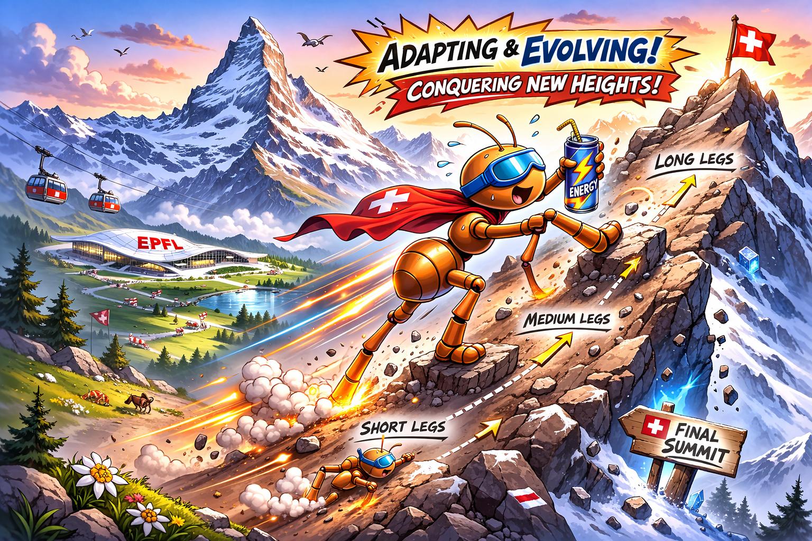

# Challenge 3: Co-evolve parameterized body and brain - hilly terrain

**Goal:** Evolve both robot controller and morphology on a hilly terrain.
**How:** Integrate the previous exercises for body and brain co-evolution.  
---

**Introduction**  
In this challenge, we adapt both body and brain by optimizing leg-length and different controller parameters. We start with a simple osscilator network (so called, [SO2-oscillators](https://www.nature.com/articles/s41467-024-50131-4)), and later compare to MLPs what integrate feedback signal and online adaptivity through Hebbian Learning (so called, [Plastic networks](https://proceedings.neurips.cc/paper/2020/file/ee23e7ad9b473ad072d57aaa9b2a5222-Paper.pdf)). We are interested in how adaptivity influence the resulting morphology.

| Checkout out the challenge3 branch:  `git checkout challenge3` |
| :----|

*Q3.0* Understanding the **World**

* What is the genome size of the SO2-oscillator?
* What is the minimum and maximum leg length?  
* What are the components in the reward function? *Hint* Read the documentation on the rewards of the Ant-v5 environment [https://gymnasium.farama.org/environments/mujoco/ant/\#rewards](https://gymnasium.farama.org/environments/mujoco/ant/#rewards)   
* What are the stopping criteria for the environment simulator.

| In the previous exercise you improved the geno2pheno mapping of the passive dynamic walker. Reduce the genotype length by adapting the geno2pheno function of the Ant.  |
| :---- |

*Q3.1* The Gym environment provides functionalities to manage multiple copies of our environments at once. The main benefit is that this allows for parallelization, i.e. we can run multiple instances of the same environment at the same time. This speed up is mainly limited to the number of CPU threads on your machine that run independently at the same time (see also [https://gymnasium.farama.org/introduction/speed\_up\_env/](https://gymnasium.farama.org/introduction/speed_up_env/))

Check the evaluate\_individual function to see where we implement this parallelisation.

* How many times do we parallelise a single individual  
  * How is the final fitness calculated over multiple parallel environments  
  * What would be the benefit of calculating fitness in this way? Hint: remember the effect of random seeds
* We now reset the environment and controllers before running the stepping loop.
  * What is the input of reset controller doing for the SO2-oscillator? 

*Q3.2* Currently, the environment is quite simple: a flat terrain, we can adjust in the create\_terrain\_file. 

| Change the terrain parameters and visualize the differences|
| :---- |

* What is the result of altering: slope_deg; bump_scale; sigma?
* Hypothesize: would there be difference in outcome when we would evolve the Ant in an environment with small obstacles like bumps?

| Set the parameters of the terrain as follows: slope_deg = 5.0, bump_scale = 0.1, sigma = 3.0. You can set the 8 parameters of body lengths: upper legs 0.2, lower legs 0.4|
| :---- |

* Overwrite the controller of the AntHill to the previous MLP of Challenge1
* Load your evolved genotype
* Is the controller able to walk up the hill?
  
| Make the legs longer|
| :---- |

* Is the controller able to walk up the hill now?
  
*Q3.3* Body and controller evolution.

* What are the current termination conditions implemented for in the step function?
* How should we alter the termination to accomondate the hill terrain?
* Can you improve the reward function?

| Run CMAES to optimise the body-lengths and SO2-oscillator. |
|:-----------------------------------------------------------|

* What are the current termination conditions implemented for in the step function?
* How should we alter the termination to accomondate the hill terrain?
* Can you improve the reward function?

| Run CMAES to optimise the body-lengths and MLP controller.|
| :---- |

* What is the dimensionality of your search space, can you reduce the MLP size?

---
Bonus: adaptive feedback control

| Run CMAES to optimise the body-lengths and Hebbian controller.|
| :---- |

* Hebbian Learning adds adaptability during deployment by changing the neuron weights. Why would this be usefull?
* What is the dimensionality of your search space?

---

| Run NSGA-II, on the same environment with MLP.|
| :---- |

* What are the two rewards that are part of the multi-objective optimisation?
  * Can you think of a better reward?

# Challenge 3 Submission Details

The given exercise should provide a fundamental understanding of practical aspects of multi-objective optimisation, and analysis of the Pareto front to understand the trade-off between morphological designs.

  

To master Challenge 3, submit:
- **Data**: Your best genotype for the MLP+8 body params (size 288) as `x_best.npy`
- **Code**: Your `ant_hill.npy` `Challenge3.py`
- **Pareto Front Visualization**: A plot showing the final Pareto front with both objectives
- **Morphology Comparison**: Table or plots analysing morphological parameters of the specialists and generalist
- **Videos**: Three renderings of the best ant with MLP controller:
  - Specialist: Of each objective
  - Generalist: The best overall 
- **Analysis Report**: A `README.md` (max. 300 words) describing:
  - Motivate the design of the multi-objective reward
  - Observed trade-offs in the Pareto front
  - Performance comparison (specialists vs. generalists)

Provide all documents in a zipped folder with the following naming convention: `2026_micro_515_SCIPER_TEAMNAME_LASTNAME1_LASTNAME2_challenge3.zip`.

# Questions?

If some parts of your code are not working or you have general questions, do not hesitate to contact your MICRO-515 teaching assistants in the exercise sessions or via e-mail `fuda.vandiggelen@epfl.ch`, `alexander.ertl@epfl.ch`, `alexander.dittrich@epfl.ch`, `hongze.wang@epfl.ch`
