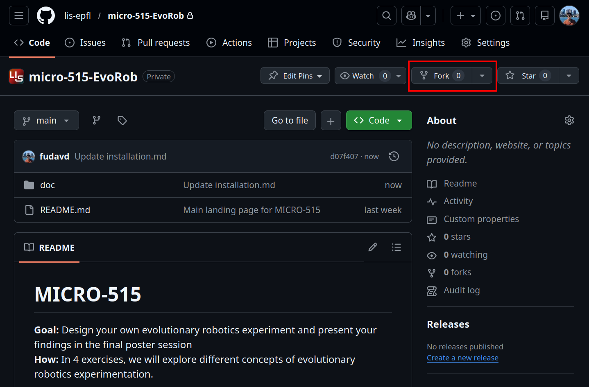
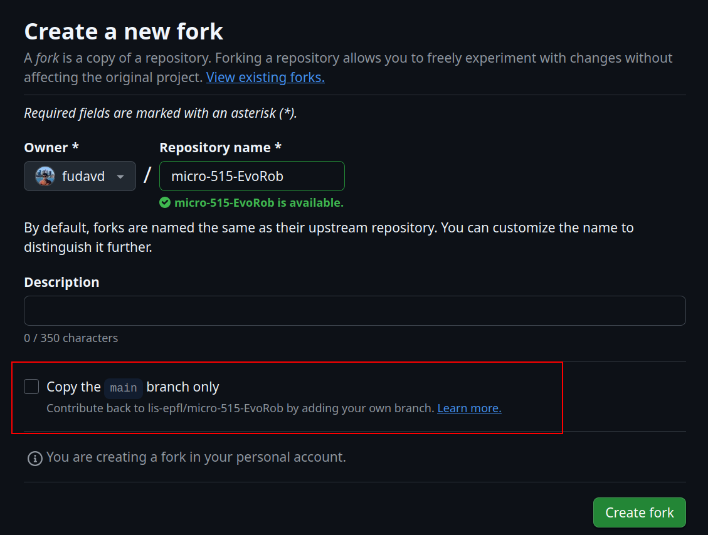

# EvoRob Installation Guide

## Linux / Ubuntu Installation

We assume you are quite independent if you decided to work with Linux. Feel free to ask for help if you get stuck. 

1. Make sure your system has the following requirements installed:  
  1. Python \>=3.8  
  2. Git [https://git-scm.com/book/en/v2/Getting-Started-Installing-Git](https://git-scm.com/book/en/v2/Getting-Started-Installing-Git)   
2. Continue below with the [General software install](#general-software-install)

## MacOS

Please follow the Windows anaconda installation

## Windows 10 / 11

We strongly encourage you to work with Linux. For those of you that cannot, follow the instructions below.

For installing Python on your PC, you can either directly install Python from the Python Software Foundation or use Anaconda. Anaconda is a Python platform, coming with additional tools such as convenient environment management and development environments. 

Download and install the latest version of Git (make sure to check the 32 or 64 bit version): [https://git-scm.com/downloads/win](https://git-scm.com/downloads/win)  

### Direct Installation Python:

1. Download the installer of the latest version of **Python 3.12** (currently 3.12.9) compatible with your hardware architecture (usually 64-bit) from [https://www.python.org/downloads/windows/](https://www.python.org/downloads/windows/)  
2. Execute the installer from your Downloads folder. **Important**: On the first screen of the installation wizard, check the box “`Add Python to PATH`**”.**  
3. Once done, you should see a screen saying "Setup was successful."  
4. Verify the successful installation of Python by opening the Command Prompt (press   `Windows Key + R`, type `cmd` and press `Enter`. Type `python --version` into the Command Prompt. If Python is installed correctly, you will see the version number displayed (Python 3.12.9).  
5. Set up a virtual environment: python \-m venv .venv  
   1. Test if your environment works: .\\venv\\Scripts\\Activate.ps1  
      1. A common a permission error can be resolved with:   
         Set-ExecutionPolicy RemoteSigned \-Scope Process  
6. Continue with the [General software install](#general-software-install)

### Anaconda Installation:

1. Download the installer of the latest version of **Python** from [https://www.anaconda.com/download/success](https://www.anaconda.com/download/success). You can either install Anaconda or Miniconda. Anaconda comes with a graphical user interface for managing environments and starting applications. Miniconda can only be accessed via the Command Prompt.  
2. Set up a virtual environment, either via the command prompt `conda create -n .venv` and `conda install python=3.12` or using the Anaconda Navigator App. In the Navigator App, go to “Environments”\-tab and press “create”. Name the environment, e.g. “micro-515”, check “Python” and select the latest subversion of Python 3.12 available. From the “Environment”-tab, you can directly start by pressing the green play-button.  
3. Continue with the [General software install](#general-software-install)

### Further resources:

* Here is an informative video, guiding the installation process on Windows, with additional information about Python paths: [https://www.youtube.com/watch?v=YKSpANU8jPE](https://www.youtube.com/watch?v=YKSpANU8jPE). The video uses an older version of Python, but the process and the information did barely change.  
* Installing virtual environments without anaconda: [https://www.youtube.com/watch?v=Y21OR1OPC9A](https://www.youtube.com/watch?v=Y21OR1OPC9A) 


# General software install

1. If needed, make an account at github: [https://github.com/signup?source=form-home-signup\&user\_email=](https://github.com/signup)
2. Go to: [https://github.com/fudavd/EvoRob](https://github.com/lis-epfl/micro-515-EvoRob)](https://github.com/lis-epfl/micro-515-EvoRob)](https://github.com/fudavd/EvoRob)
3. Fork the repository without changing the name:

   

   A _fork_ is a copy of the original repository that is created under your account. This gives you the freedom to freely develop things on your own.
   **Make sure to fork all the branches by unticking the box below:**

   

4. On GitHub, navigate to **your fork** of the EvoRob repository and copy the url, it should look like: `https://github.com/<your_username>/EvoRob`
5. Open a command line (in windows: `Windows Key + R`, type `cmd` and press `Enter`)
6. Now in your command line go to a directory of choice, using the [cd](https://learn.microsoft.com/en-us/windows-server/administration/windows-commands/cd) command:
  1. To go to a directory type: cd Documents
  2. To move up a folder: cd ..
7. Download your EvoRob repository on your machine using:
   git clone `https://github.com/<your_username>/EvoRob`

## Linux (Ubuntu) Requirements Installation

To install the requirements using `conda` run
```
conda env create -f environment.yml
conda activate micro515
```
or if you prefer using python virtual environments
```
python -m venv .venv
source .venv/bin/activate
python -m pip install --upgrade pip
pip install -r requirements.txt
```

## Windows 10 / 11 Requirements Installation

1. Activate your virtual environment (see previous virtual environment steps)  
2. python \-m pip install \--upgrade pip  
3. pip install \-r requirements.txt  
4. Check if your install was successful:  
   python TestScript.py


## Project Installation
To install the project so it can be imported from anywhere run
```
pip install -e .
```
from the root directory.


----------------------------------------------------------------------
Set the environment variable `SOLVED` to import ERs from solution files.
